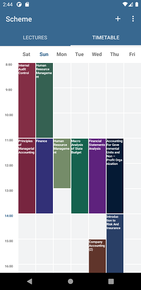
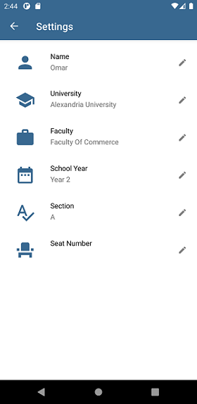
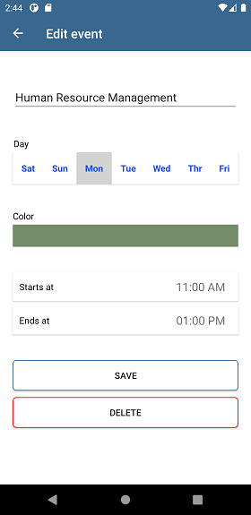

# Scheme
An application to help college students catch all their lectures and appointments by providing reminders and time-organizing tools

**Application Data**
-----------

The application is currently using data that was extracted from Alexandria University (Egypt) previous years' lecture schedules, 
this data is not very clean so some lectures might overlap each other or have invalid starting time but this shouldn't cause any crashes

**Screenshots** 
-----------

